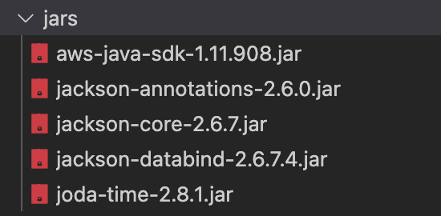

# sns-java-cfml
Demo how to send SMS using a custom sender id using CFML/java

To run this install docker, then clone this repo and run

```
docker compose up
```

You can edit the code in www folder, then browse to http://localhost:8500/test-sns.cfm to run the code.

Make sure you have AWS creds in config/.env  ( rename the template )

In the jars folder make sure you have the following:



You can download this from:  https://mvnrepository.com/artifact/software.amazon.awssdk/bom/2.15.38

App.cfc will load the jars without needing to drop them into the lib folder.